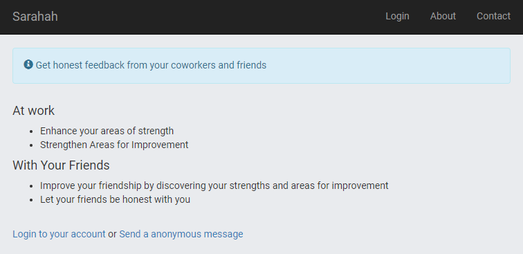
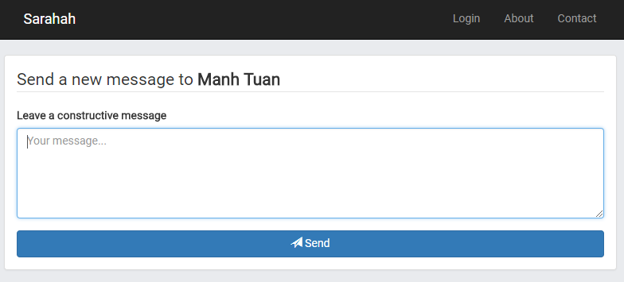
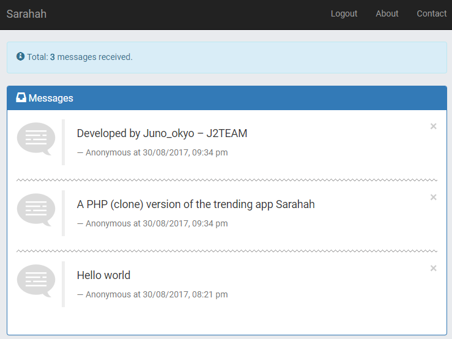
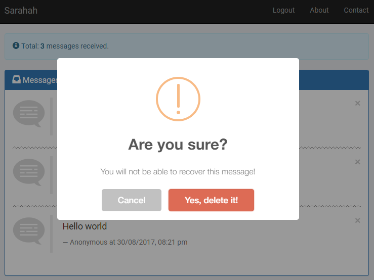

# PHP Sarahah Clone

A PHP (clone) version of the trending app Sarahah

**Note:** This is an open-source project, so I can not [upload your contacts](https://thehackernews.com/2017/08/sarahah-privacy.html) to anywhere :trollface:

## Screenshots

## Installation

1. [Download the latest version](https://github.com/J2TeaM/php-sarahah-clone/archive/master.zip).
2. Unzip file.
3. Create a new Database and import **sarahah.sql** (from **_install** folder).
4. Rename **config.php.example** to **config.php** and edit content with your info (database, admin account, reCaptcha,...).
5. [Install Composer](https://getcomposer.org/download/) and run the command `composer install` to install dependency libraries.
6. Upload anything except the **_install** folder.

## Usage

Just share the following link on your social networks to start receiving the message:

> https://your-website.com/sarahah/new-message.php

## Contributing

1. Fork it!
2. Create your feature branch: `git checkout -b my-new-feature`
3. Commit your changes: `git commit -am 'Add some feature'`
4. Push to the branch: `git push origin my-new-feature`
5. Submit a pull request :D

## Credits

- Original idea by [Sarahah](https://www.sarahah.com/)
- [Bootstrap](http://getbootstrap.com/)
- [Google reCaptcha](https://www.google.com/recaptcha/)
- [mysqli-database-class](https://github.com/joshcam/PHP-MySQLi-Database-Class) by joshcam

## License

[MIT LICENSE](LICENSE)